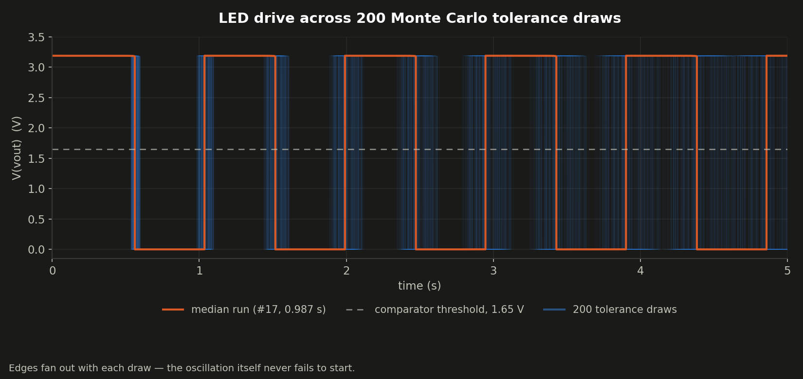
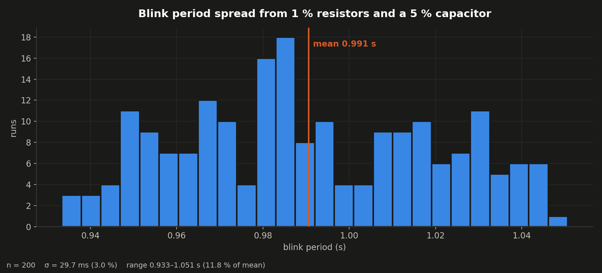

# Eclectronics Mini-Project 1 — Op-Amp LED Blinker

A 35 × 20 mm two-layer PCB that blinks an LED once per second, using no
microcontroller and no 555 — just two op-amps, an RC network, and a 3.3 V
regulator. Designed from scratch in LTspice, verified against component
tolerances with a 200-run Monte Carlo sweep, then laid out in KiCad.

<p align="center">
  
</p>

---

## How it works

<p align="center">
  
</p>

The circuit is a **relaxation oscillator** built from a Schmitt trigger and an
RC integrator:

1. **U1** buffers a `VDD/2` = 1.65 V reference, set by the 100 kΩ divider
   (R5/R6 in simulation). This is the voltage everything else swings around.
2. **U2** is the comparator. R1 and R2 — both 100 kΩ — feed its output back to
   its own non-inverting input, so the switching threshold *moves* depending on
   which way the output is already saturated. That positive feedback is the
   hysteresis, and it is what makes the circuit oscillate rather than settle.
3. **R3** (361.4 kΩ) charges and discharges **C1** (1 µF) from the output. When
   the capacitor voltage crosses the moving threshold, the comparator flips, the
   capacitor reverses direction, and the cycle repeats.
4. The output drives **LED1** through a current-limiting resistor.

The RC time constant and the hysteresis ratio together set the period to
roughly one second — slow enough to read by eye, which is the whole point.

> **Design detail:** the 361.4 kΩ timing resistor isn't a stock value. On the
> board it's built as **301 kΩ + 60.4 kΩ in series** (R6 + R7), two standard E96
> parts that sum to exactly the simulated value.

---

## Does it survive real components?

A schematic that works at nominal values means little — real resistors are ±1 %
and the capacitor is ±5 %. The LTspice deck wraps every passive in `mc()`
tolerance macros and sweeps **200 randomized builds**:

```spice
.tran 0 5 0
.meas TRAN Tperiod TRIG V(vout)=1.65 RISE=2 TARG V(vout)=1.65 RISE=3
.step param run 1 200 1
```

The measurement deliberately times between the **second and third** rising
edges, skipping the power-on transient so the first, atypical cycle never
pollutes the statistic.

<p align="center">
  
</p>

Every one of the 200 builds oscillates — none latch up, none fail to start. The
traces begin tightly grouped and fan out as the run proceeds, because a small
per-cycle period error accumulates as a growing phase difference.

<p align="center">
  
</p>

| Metric | Value |
|---|---|
| Runs | 200 |
| Mean period | **0.991 s** (1.010 Hz) |
| Standard deviation | 29.7 ms (**3.0 %**) |
| Full range | 0.933 – 1.051 s (11.8 % of mean) |

A 3 % spread from 1 % resistors and a 5 % capacitor is the expected outcome —
the capacitor dominates the error budget. The worst-case build is still within
6 % of one second.

The 200 measured periods are committed as
[`ltspice/tperiod-montecarlo.csv`](ltspice/tperiod-montecarlo.csv).

---

## Schematic

<p align="center">
  
</p>

Full-resolution PDF: [`docs/kicad-schematic.pdf`](docs/kicad-schematic.pdf)

---

## The board

Two layers, 35 × 20 mm, 15 components, entirely 0603 passives and SOT-23
actives.

| Top | Bottom |
|---|---|
|  |  |

Copper and silkscreen, as plotted for fabrication:

| Front (F.Cu + silkscreen) | Back (B.Cu) |
|---|---|
|  |  |

Gerbers are in [`fabrication/`](fabrication/), zipped and ready to upload.

### Bill of materials

| Ref | Part | Value / function |
|---|---|---|
| U1 | MCP1702T-3302E/CB | 3.3 V LDO regulator |
| U2, U3 | MCP6021T-E/OT | Rail-to-rail op-amp |
| R1–R4 | RC0603FR-07100KL | 100 kΩ — reference divider and hysteresis |
| R5 | RC0603FR-07301RL | 301 Ω — LED current limit |
| R6 | RC0603FR-07301KL | 301 kΩ — timing (with R7) |
| R7 | RC0603FR-0760K4L | 60.4 kΩ — timing (with R6) |
| C1 | C0603C105K3RACTU | 1 µF — timing capacitor |
| C2, C3 | C0603C105K3RACTU | 1 µF — supply decoupling |
| LED1 | LTST-C171KRKT | Red indicator LED |
| J1 | Molex 480370001 | Power input connector |

---

## Known issues

These come from a fresh `kicad-cli` DRC/ERC run and are recorded honestly rather
than hidden. **The board has not been fabricated.**

- **Malformed board outline (error).** The J1 footprint, imported from SnapEDA,
  carries its own rectangle on the `Edge.Cuts` layer in addition to the board's
  outline. KiCad reports "board has malformed outline (not a closed shape)", and
  it's the stray rectangle visible off the left edge of the front-copper plot. A
  fab house would reject or mis-route this. **Fix before ordering:** move that
  graphic off `Edge.Cuts`.
- **Dangling via / co-located holes (warnings).** One via connects on only one
  layer, and two drilled holes sit at the same coordinate.
- **Silkscreen over copper, ×27 (warnings).** Cosmetic — reference designators
  overlapping pads.
- **ERC pin-type warnings, ×28.** The DigiKey-sourced symbols declare every pin
  as *Unspecified*, so ERC can't reason about them. Noise, not defects.

---

## Repository layout

```
kicad/        KiCad 10 project — schematic, board, and the
              symbol/footprint libraries it depends on
ltspice/      Simulation deck, netlist, solver log, extracted results
fabrication/  Gerbers + zipped fab package
docs/         Project write-up and schematic PDF
images/       Every figure in this README — all generated, none hand-made
tools/        The scripts that generate them
```

### Opening the project

Open `kicad/eclectronicsmp1.kicad_pro` in **KiCad 10**. Symbol and footprint
libraries resolve through `${KIPRJMOD}`-relative paths in `fp-lib-table` and
`sym-lib-table`, so the project is self-contained — nothing needs installing.

Open `ltspice/LTSpiceSchematicMP1.asc` in **LTspice 26** and run it to reproduce
the sweep. Expect a few minutes and a ~36 MB `.raw` file.

### Regenerating the figures

```powershell
pwsh tools/generate_assets.ps1
```

Everything in `images/` is rebuilt from the design files, so the README can
never drift from what's actually in the schematic and board.

| Script | Purpose |
|---|---|
| `attach_3d_models.py` | Maps the SnapEDA footprints to KiCad's stock 3D models — without it the renders show a bare board |
| `render_pcb_layers.py` | Composites the 2D copper/silkscreen views |
| `render_ltspice_asc.py` | Draws the `.asc` as SVG — LTspice has no headless image export |
| `plot_montecarlo.py` | Extracts the 200 periods from the solver log and plots them |
| `pdf_to_png.py` | Rasterizes and trims kicad-cli's PDF output |

### A note on what isn't committed

LTspice's `.raw` solver output is ~36 MB and its `.txt` waveform export ~11 MB.
Neither is viewable on GitHub and both regenerate by re-running the sim, so they
are gitignored. The `.log` **is** committed — it carries all 200 measured
periods, which is the part that actually matters.
