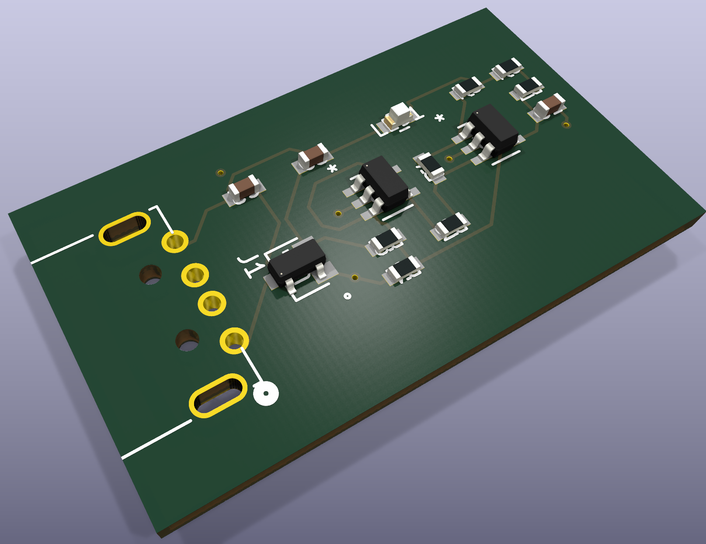
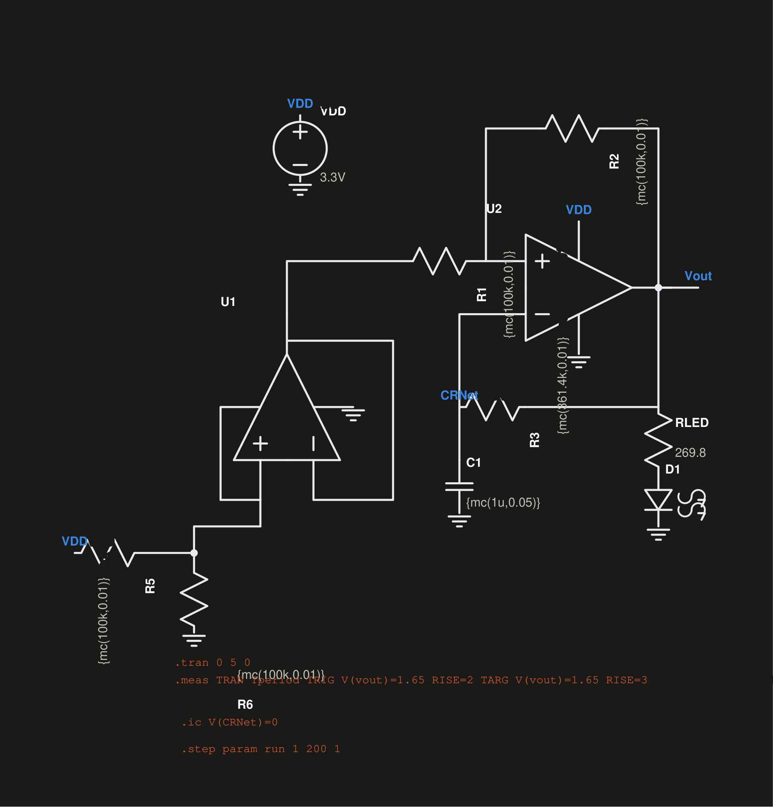
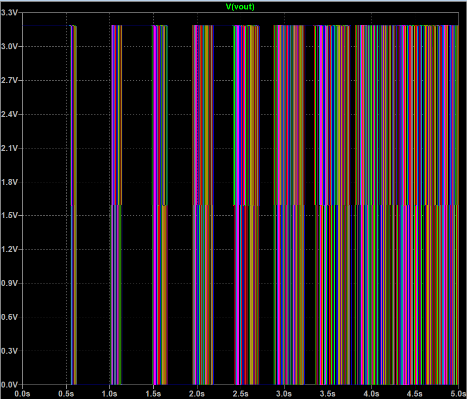
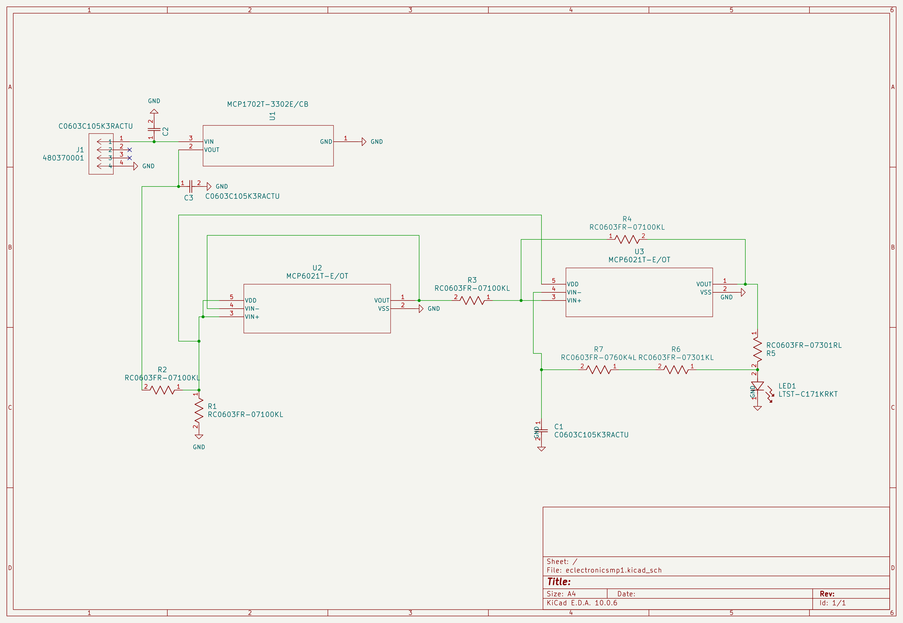
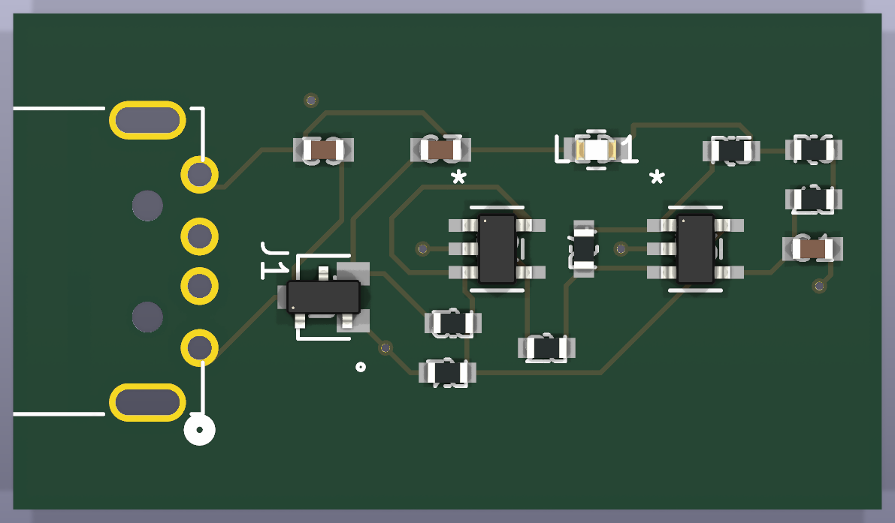
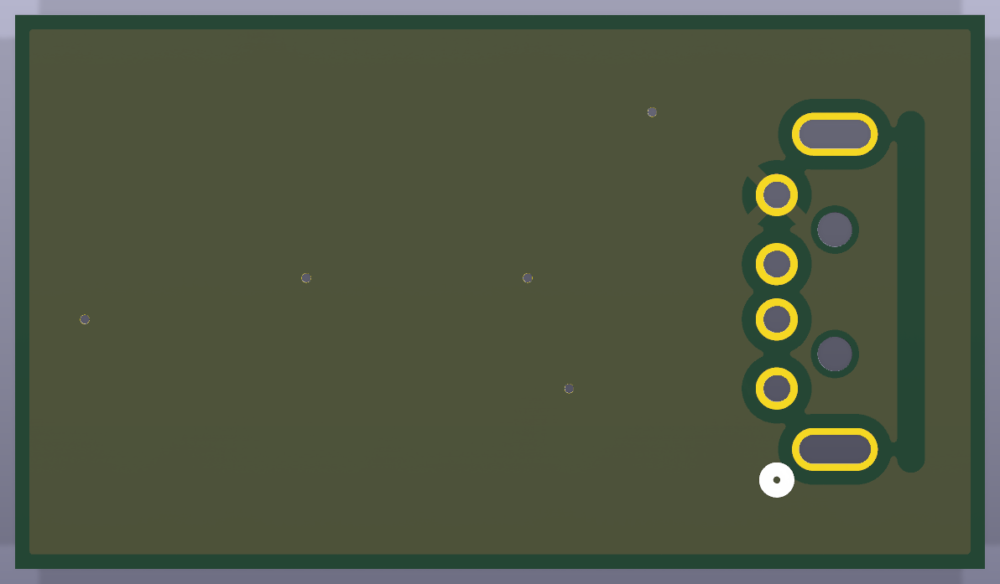
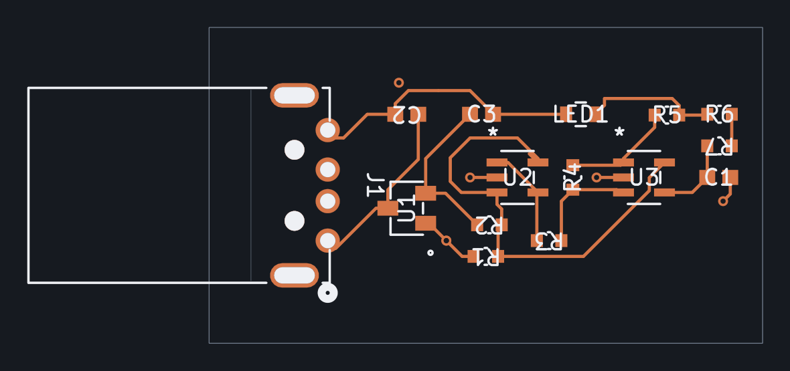
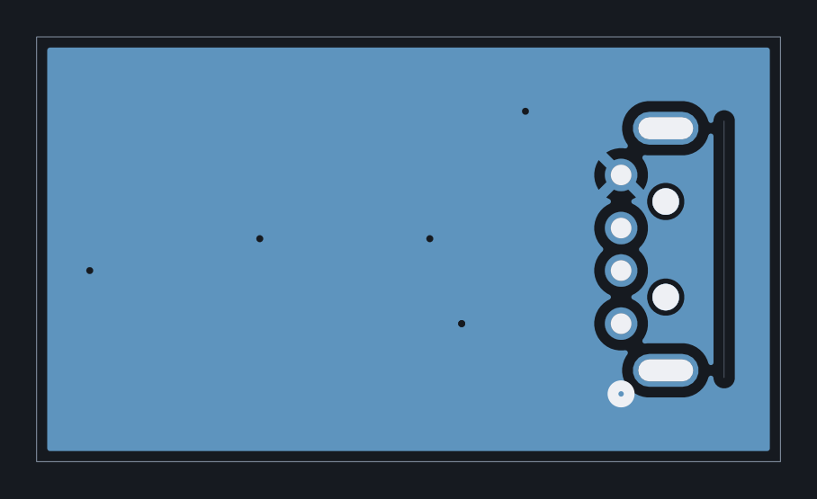

# Eclectronics Mini-Project 1
Final right up can be found here: docs/Electronics-Mini-Project-1.pdf
<p align="center">
  
</p>

---

## Simulation

<p align="center">
  
</p>

200-run Monte Carlo over 1 % resistor and 5 % capacitor tolerances:

<p align="center">
  
</p>

---

## Schematic

<p align="center">
  
</p>

PDF: [`docs/kicad-schematic.pdf`](docs/kicad-schematic.pdf)

---

## The board


| Top | Bottom |
|---|---|
|  |  |


| Front (F.Cu ) | Back (B.Cu) |
|---|---|
|  |  |


---

## Repository layout

```
kicad/        KiCad 10 project: schematic, board, and the
              symbol/footprint libraries it depends on
ltspice/      Simulation and results
fabrication/  Gerbers 
docs/         Project write-up and schematic PDF
images/       Images for the README    
```
